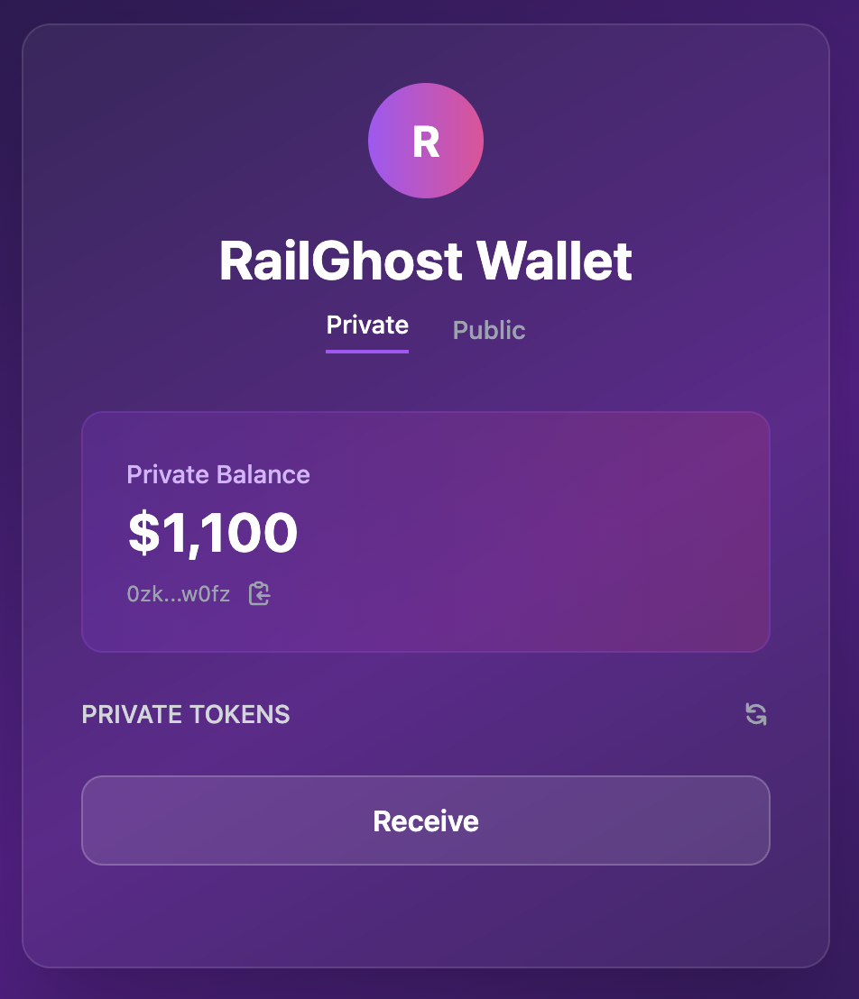

# RailGhost - Railgun wallet extension

This is a project to explore the [Railgun Wallet SDK](https://github.com/Railgun-Community/wallet).

Currently, Railgun has desktop and mobile wallets, so I decided to create a browser extension wallet to test different flows of the Wallet SDK.

The React codebase is a quick prototype using Ethereum Sepolia and three tokens, which you can find [here](./src/contexts/WalletContext.tsx).

The wallet is not complete, as it is missing some basic flows, but it allows the user to:
- Create or import an existing wallet
- Display private and public funds
- Approve and shield an ERC-20 public token

# Screenshots

  
  
  
  
  
  
  

